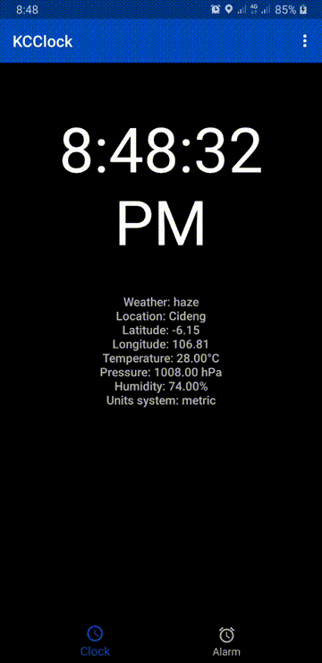
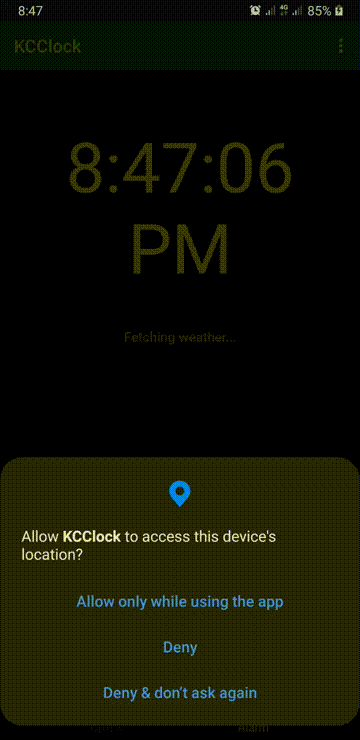
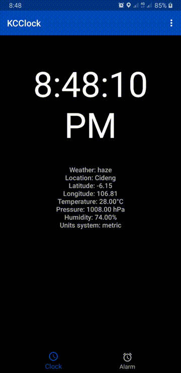

# KCClock

A simple alarm app that can ring on timed schedules or other event, such as battery full-charging! This is a project I developed for a Mobile Programming course mid-term project at my campus. It is still experimental, though, especially the event-based alarm.

## Installation

### Prerequisites:
1. Java
2. Gradle
3. Android SDK
4. Or just install Android Studio should work fine.

### Steps
1. Clone this project to local.
2. Open the project with an IDE (I use Android Studio for its many many development tools).
3. Create res/values/secrets.xml with content string "openweather-api-key" to access OpenWeather API for weather feature. Get your API key by signing up [here](https://home.openweathermap.org/users/sign_up).
4. Build (and sync the Gradle) and run on an Android phone/tablet or an AVD.

## Features

### Create and Manage Alarm

The main feature of this app is to create and manage alarms. Time-based alarms are common alarms which ring as scheduled. Alarms are registered to AlarmManager and stored using Room database. Registered alarm will trigger broadcast receiver and start foreground service to ring the alarm.

### Get Current Weather using OpenWeather API

Weather data is a mini-feature implemented using AsyncTask and Volley, retrieving data from OpenWeather API. The app will request permission for location access if not yet allowed. Denying the permission request will only disable weather feature; other features will still work fine.

### Basic Clock Animation using OpenGL ES 2.0

Clock animation is generated using OpenGL ES 2.0, using GLSurfaceView and GLRenderer. Clock components are constructed from custom polygons. Rotation of short clock hand is 1/12 slower than long clock hand, thus mimicking real hour-hand and minute-hand behavior.

## Bugs & Not-Implemented Features

There are still some bugs or broken features as listed below.

- AlarmRingActivity only displays data from very first intent received. Newer alarms will still ring, but activity shows data of the first rang alarm.
- Still cannot check from AlarmReceiver whether EventBased Alarm(s) has been created or not. Problem with asynchronous Room access. Need other option to store EventBasedAlarm data.
- Because cannot check EventBased Alarm existence, its ringing functionality has not been tested.
- Vibrator in AlarmRingService broke my device's vibrator. My device can't vibrate anymore after this app's first vibration.
- Alarm Rescheduling on device's boot is still not working. Problem with background task(s).
- Have not implemented app's locale change connected to app's Language Setting.

## Author

Kevin Christian Chandra

Faculty: Faculty of Computer Science, Universitas Indonesia

Student ID: 1706039976

Class: B